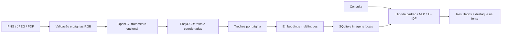

# DocLens

**Seus documentos, em foco.** OCR e busca híbrida em memorandos e comunicados em português.

Pesquise **“problemas nos computadores”**, encontre um comunicado sobre **“manutenção dos
equipamentos de informática”** e confira o trecho destacado na página de origem.

Este projeto de portfólio combina **Python, visão computacional, NLP e desenvolvimento web**.
Os modelos são pré-treinados; a contribuição do projeto está na integração, no tratamento de
imagens, na preservação das fontes e na avaliação reproduzível.

## O que funciona

- Upload de PNG, JPEG e PDF: até 10 MB, cinco páginas e 25 megapixels por imagem.
- OCR em português/inglês, executado localmente em CPU.
- Busca híbrida como padrão, com NLP e TF-IDF também disponíveis para comparação.
- Passagens por frase, verificação local de relevância e rejeição de resultados fracos.
- Correção conservadora de digitação e interpretação de preferências explícitas, com aviso na interface.
- Resultados com documento, página, texto, pontuação e destaque visual.
- SQLite preserva texto e vetores após reiniciar a aplicação.
- Um exemplo fictício pode ser enviado pelo botão **Testar com um exemplo**.

## Executar

Pré-requisito: [uv](https://docs.astral.sh/uv/). O projeto usa Python 3.12; o uv consegue obter
essa versão quando ela não está instalada. Não é necessário ativar manualmente a `.venv`.

Na pasta do projeto:

```powershell
uv sync --locked
uv run python -m scripts.prepare_models
uv run uvicorn doclens.api:app --host 127.0.0.1 --port 8000 --no-proxy-headers
```

Abra **http://127.0.0.1:8000**. A documentação interativa da API fica em **/docs**.

O primeiro comando instala as dependências fixadas em `uv.lock`. O segundo baixa os pesos,
verifica os SHA-256 autorizados do OCR e registra as revisões do NLP em `config/models.json`.
Esse download
pode demorar e usar centenas de MB, incluindo um segundo modelo que verifica a relevância
da pergunta com cada trecho. Downloads verificam TLS usando os certificados
confiáveis do sistema, inclusive no Windows.

Os exemplos já estão em `data/fixtures`. Para popular a biblioteca com os 12 documentos:

```powershell
uv run python -m scripts.load_demo
```

Para recriar as imagens e PDFs fictícios:

```powershell
uv run python -m scripts.generate_corpus
```

O gerador usa Arial no Windows e DejaVu Sans no Linux. As fixtures entregues permitem repetir
a avaliação sem diferenças de renderização entre sistemas. Os uploads e o banco ficam em
`.data/`; os modelos em `.cache/models/`. Ambos estão excluídos do Git. Para usar outro banco,
defina `DOCLENS_DATA_DIR` antes de iniciar a aplicação.

## Como os dados percorrem o sistema



As camadas têm responsabilidades diferentes: `vision` lê imagens/PDFs; `models` carrega
as redes; `search` divide e ordena trechos; `storage` persiste dados; `service` coordena o
processamento; `api` expõe HTTP. A interface usa HTML, CSS e JavaScript, sem build de frontend.

`contracts` documenta blocos, passagens e a interface dos modelos com tipos internos, sem
validar ou converter dados em execução. Os comandos de avaliação compartilham corpus,
métricas, cache e calibração em `scripts/evaluation_support.py`; cada comando mantém sua
execução e geração de relatórios. A leitura da biblioteca reutiliza geometria por página
somente durante a consulta atual, mantendo uploads e reindexações visíveis na próxima leitura.

As páginas exibidas são exatamente as imagens enviadas ao OCR. Assim, o destaque continua
alinhado mesmo quando uma página foi corrigida pelo OpenCV. Cada passagem guarda os intervalos
de caracteres de suas linhas; recortes dentro de uma linha são aproximados. PDFs com texto selecionável
também passam por OCR nesta versão para manter o mesmo fluxo de visão computacional.

## API

| Método | Rota                                   | Comportamento                                                     |
| ------ | -------------------------------------- | ----------------------------------------------------------------- |
| POST   | `/documents`                           | Recebe multipart com `file`; processa e retorna o documento (201) |
| GET    | `/documents`                           | Lista documentos indexados                                        |
| GET    | `/documents/{id}`                      | Retorna páginas, texto reconhecido e blocos com coordenadas       |
| GET    | `/documents/{id}/pages/{number}/image` | Retorna a imagem usada no OCR                                     |
| POST   | `/search`                              | Recebe consulta, método e quantidade; retorna trechos ordenados   |
| GET    | `/health`                              | Confirma execução e política de pré-processamento                 |

Exemplo de consulta:

```json
{ "query": "problemas nos computadores", "method": "hybrid", "top_k": 5 }
```

`method` aceita `hybrid`, `semantic` e `tfidf`; quando omitido, usa `hybrid`.
`top_k` vai de 1 a 10. Cada resultado contém `id`,
`document_id`, `filename`, `page`, `text`, `score` e `boxes`. As caixas são quadriláteros
em pixels da página processada. O SVG da interface usa essas dimensões como `viewBox`.

O upload é síncrono e a interface mostra o processamento. Um segundo upload simultâneo
recebe 409. Erros esperados usam mensagens em português: limite de tamanho (413), tipo
incompatível (415), arquivo inválido/sem texto (422) e falha ao carregar modelos (503).
Usar uma única instância/worker: a aplicação foi projetada para uso local por uma pessoa.

## Busca

O modo híbrido recupera até 30 candidatos por método, reúne passagens iguais e combina suas
posições com Reciprocal Rank Fusion (RRF), com pesos iguais e constante 60. A união permite
encontrar paráfrases mesmo sem sobreposição de palavras. Até 30 candidatos passam pelo
verificador local; um bônus limitado de relevância favorece frases específicas. A fusão
preserva texto e coordenadas de cada passagem e não amplia os destaques.

O método semântico recupera candidatos por embeddings e combina cosseno com uma verificação
de relevância da consulta completa. O modo por palavras usa TF-IDF com normalização de acentos,
stopwords e stemming em português, mantendo a ordem lexical após a mesma verificação.
No modo híbrido, `score` é RRF mais `0,002 × clip(logit, 0, 4)` de relevância, com bônus máximo
de 0,008. Nos outros modos, é o cosseno dos embeddings ou dos vetores TF-IDF; a ordem semântica
inclui um ajuste limitado do verificador. As pontuações dos três métodos não são diretamente
comparáveis e não representam probabilidade de acerto.
`top_k` é um máximo: os filtros podem retornar menos trechos ou nenhum.

O resultado preserva `query` e informa `interpreted_query`, `corrections` e `excluded_terms`.
A interface mostra quando a consulta foi ajustada. A correção usa um dicionário local em
português; códigos, números, siglas, palavras conhecidas e termos presentes na biblioteca
são preservados. Preferências como “não quero X; preciso de Y” focam Y e excluem X;
negações de sintomas, como “o computador não liga”, continuam intactas.

## Avaliação e testes

```powershell
uv run pytest -m "not models" -q
node --test tests/frontend.test.cjs
uv run ruff check doclens scripts tests
uv run python -m scripts.evaluate --refresh
uv run python -m scripts.evaluate_search
uv run python -m scripts.evaluate_hybrid
uv run python -m scripts.evaluate_stress
uv run python -m scripts.fuzz_uploads
```

Os testes de concorrência da interface usam o runner nativo do Node.js 24, sem pacotes npm.
Node só é necessário para esses testes; a aplicação continua servida pelo FastAPI.

Teste de integração com OCR e embeddings reais, incluindo PDF:

```powershell
$env:DOCLENS_RUN_MODELS = "1"
uv run pytest -m models -q
```

- **OCR:** taxa de erro de caracteres (CER), com normalização Unicode NFC, caixa baixa e
  espaços uniformes. Menor é melhor. Também registramos tempo por página.
- **Pré-processamento:** comparar imagem original com contraste/deskew. Escolher a menor
  CER ponderada em quatro documentos de desenvolvimento; empates favorecem a imagem original.
  Avaliar a política em oito documentos separados e reiniciar o servidor após atualizar a política.
- **Busca atual:** 20 consultas com resposta e 10 sem resposta. Além de Recall@3 por documento,
  medir foco da passagem, rejeição de consultas sem resposta e tamanho dos destaques.
  Limiares de relevância são escolhidos em development, com `evaluate_search --calibrate`
  para NLP/TF-IDF e `evaluate_hybrid --calibrate` para a opção híbrida.
- **Diagnóstico:** repetir as buscas sobre transcrição correta, OCR limpo e OCR degradado.
  Isso ajuda a identificar quanto da perda de qualidade vem do reconhecimento de texto.

O OCR e a busca original permanecem reproduzíveis em [reports/results.md](reports/results.md),
com dados completos em [reports/metrics.json](reports/metrics.json). `--refresh` recalcula o OCR;
sem essa opção, a avaliação reutiliza o cache local de OCR.

A comparação dos três modos está em [reports/hybrid-search.md](reports/hybrid-search.md),
com consultas, pontuações componentes e trechos no JSON correspondente. Sobre OCR limpo,
a opção híbrida encontrou uma passagem focada no primeiro resultado em **20/20** consultas;
NLP em **19/20** e TF-IDF em **15/20**. Os três métodos rejeitaram **10/10** perguntas sem
resposta; TF-IDF rejeitou **10/10**, mas deixou três paráfrases válidas sem resultado.
Sobre OCR degradado, a híbrida teve foco em top 1 em **19/20** consultas. Esses dados são
diagnóstico de um corpus sintético já inspecionado, não uma garantia para documentos reais.

Uma rodada adicional investigou entradas inválidas, falhas de modelos, uploads alterados e
respostas HTTP fora de ordem. As correções e os resultados estão em
[reports/hardening.md](reports/hardening.md). Em 15 consultas adicionais anotadas, a híbrida
obteve foco no primeiro trecho em **13/15**; rejeitou **7/7** consultas sem resposta e passou
**4/4** casos de referências explícitas. Os dois casos sem resultado exigem detalhes que
não constam explicitamente no corpus. A investigação dos cinco casos está em
[reports/query-recovery.md](reports/query-recovery.md). Esse conjunto ampliado revela limites que as primeiras
20 consultas não mostravam; todos os casos estão em `reports/search-stress.json`.

A melhoria anterior está em [reports/search-comparison.md](reports/search-comparison.md),
com consultas e trechos no JSON correspondente. `scripts/search_baseline.py` preserva a busca
anterior exclusivamente para essa comparação. O relatório informa quando o TF-IDF deixa
paráfrases sem resposta após remover correspondências fracas.

Na avaliação inicial, o tratamento reduziu a CER dos documentos degradados de avaliação de
**11,11% para 1,20%**. Nas 13 consultas de avaliação sobre OCR, TF-IDF obteve **100%** de
Recall@3 e a busca semântica **84,6%**. Neste corpus, a referência lexical foi melhor; os dois
métodos permanecem disponíveis para investigar seus comportamentos.

Os testes rápidos usam doubles dos modelos para verificar contratos HTTP, erros e persistência
sem rede. O teste `models` e a avaliação usam as redes reais. Os documentos e as consultas são
sintéticos: desempenho neste conjunto pequeno não demonstra precisão em documentos reais.

## Referências e licença

- [EasyOCR](https://github.com/JaidedAI/EasyOCR): detecção e reconhecimento de texto.
- [Modelo multilíngue](https://huggingface.co/sentence-transformers/paraphrase-multilingual-MiniLM-L12-v2): embeddings.
- [Sentence Transformers](https://www.sbert.net/docs/sentence_transformer/usage/semantic_textual_similarity.html): similaridade.
- [FastAPI](https://fastapi.tiangolo.com/): API e validação.
- [pypdfium2](https://pypdfium2.readthedocs.io/): renderização de PDF.

Código e documentos fictícios: [MIT](LICENSE). Bibliotecas, fontes e pesos mantêm suas próprias
licenças. Fontes do sistema e pesos dos modelos não são distribuídos neste repositório.
