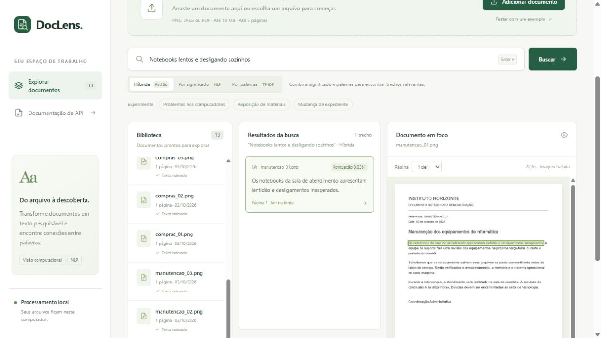

# Testes adicionais e correções: 03/10/2026

Este relatório registra a primeira rodada de robustez. Três dos cinco casos remanescentes
foram resolvidos posteriormente; a revisão das fontes e os resultados atuais estão em
[query-recovery.md](query-recovery.md). As métricas abaixo preservam aquela rodada.

As correções foram reproduzidas com testes antes de serem aplicadas. A busca híbrida
continua como padrão; NLP e TF-IDF continuam disponíveis. As alternativas e os motivos
estão em [docs/hardening.md](../docs/hardening.md).

## Verificações executadas

| Verificação | Resultado |
| --- | --- |
| Python rápido, modelos simulados | 109 testes passaram |
| Integração com EasyOCR, embeddings, verificador e PDF reais | 1 teste passou |
| JavaScript: respostas fora de ordem, cancelamento e texto literal | 8 testes passaram |
| Ruff | Sem erros |
| Uploads com bytes alterados ou truncados | 120 casos; zero erros 500 e zero registros parciais |
| Biblioteca após reinício e atualização do índice | 13 documentos e 13 imagens preservados |
| Interface no navegador | Três modos verificados; destaque alinhado; zero erros de console |

O fuzz usou seed `20261003`, 40 casos de cada formato, banco temporário e OCR simulado.
92 arquivos receberam 422; 28 permaneceram legíveis para os decodificadores e foram
aceitos com 201. Alterar bytes não torna necessariamente um arquivo ilegível. Esse
experimento não cobre todo arquivo malformado nem demonstra ausência de falhas.
Detalhes: [upload-fuzz.json](upload-fuzz.json).

Foram corrigidos: conversão de transparência para fundo preto; perda silenciosa de quadros
de PNG animado; decodificação antes do bloqueio de upload; chamadas concorrentes ao
PDFium; respostas antigas aplicadas na interface; erros 500 na validação de entradas
Unicode/JSON; saídas inválidas dos modelos; referências e anos incorretos aceitos na busca;
descarte antecipado de candidatos exclusivos de um método; recuperação alternativa sem
limite de rejeição; divisão de frases com aspas e falha em blocos sem geometria.

Testes verificam também rollback após falha na segunda página, liberação do processador,
orientação EXIF, número zero e validação estrita de `top_k`. Os testes de concorrência
do PDF usam objetos simulados para detectar sobreposição sem provocar falhas nativas.

## Consultas adicionais com modelos reais

Criamos 26 casos: 15 consultas com documento relevante, sete sem resposta e quatro de
referências explícitas. As mesmas passagens de OCR limpo e os mesmos modelos foram usados
nos três métodos. As consultas incluem paráfrases, erros de digitação, negação e datas.
As anotações foram definidas antes da primeira execução, mas os casos já foram inspecionados
durante as correções: são diagnóstico e regressão, não uma avaliação independente.

| Método | Documento relevante em top 3 | Trecho focado em top 1 | Rejeição sem resposta | Referências explícitas |
| --- | ---: | ---: | ---: | ---: |
| Híbrida | 11/15 | 11/15 | 7/7 | 4/4 |
| NLP | 10/15 | 9/15 | 7/7 | 4/4 |
| TF-IDF | 10/15 | 9/15 | 7/7 | 4/4 |

Antes do filtro de anos, os três métodos rejeitavam 6/7 consultas sem resposta. A pergunta
“Entrega de equipamentos de proteção em dezembro de 2030” selecionava uma fonte de 2026.
Após a correção, é rejeitada. As contagens de acertos positivos deste conjunto permaneceram
iguais. A reserva de candidatos e o limite da recuperação alternativa resolveram casos
determinísticos de regressão, sem aumentar artificialmente essa métrica.

Na avaliação original de 20 consultas positivas e 10 negativas, a híbrida manteve foco
em top 1 em 20/20 consultas sobre OCR limpo e 19/20 sobre OCR degradado. NLP manteve
19/20 e 18/20; TF-IDF manteve 15/20 e 14/20. Os relatórios originais foram recalculados
com a implementação atual em [hybrid-search.md](hybrid-search.md).

## O que permanece limitado

A híbrida não retornou resultado para quatro consultas adicionais:

- “probelmas nos computdores”;
- “O computador não liga”;
- “Onde entregar o certificado depois do curso?”;
- “Não quero ar-condicionado: preciso de luvas para limpeza”.

Os documentos anotados tratam desses temas, mas a relação com a pergunta pode exigir uma
paráfrase mais forte ou conter informação que não está explicitamente descrita, como o
local de entrega. Não baixamos os limiares gerais para forçar respostas: isso poderia
voltar a destacar assuntos próximos sem responder à consulta.

No conjunto original, “Inscrição no plano de saúde dos funcionários” ainda produz um
trecho indevido na híbrida e no NLP. Os filtros de códigos/anos não resolvem compreensão
de negação ou toda restrição da pergunta. O verificador também pode errar. Confira a fonte;
pontuações não representam probabilidade de acerto.

Foco é medido automaticamente por alinhamento de palavras e cobertura da frase anotada;
não substitui julgamento humano. Os tempos nos JSONs incluem cache do verificador e não
representam a latência da interface. Os resultados publicados usam somente documentos
fictícios; a biblioteca local foi preservada sem publicar seu conteúdo.

Consultas e trechos completos: [search-stress.json](search-stress.json).
Contagens e comparação antes/depois: [hardening.json](hardening.json).

## Reproduzir

```powershell
uv run pytest -m "not models" -q
node --test tests/frontend.test.cjs
uv run ruff check doclens scripts tests
uv run python -m scripts.fuzz_uploads
uv run python -m scripts.evaluate_stress
uv run python -m scripts.evaluate_hybrid
$env:DOCLENS_RUN_MODELS = "1"
uv run pytest -m models -q
```

As avaliações requerem modelos baixados e cache de OCR gerado por `scripts.evaluate`.
O CI inclui os testes rápidos de Python e JavaScript; a execução remota no GitHub não foi
realizada nesta rodada. Avisos de depreciação das bibliotecas ainda aparecem; os testes
passaram com as dependências fixadas em `uv.lock`.


