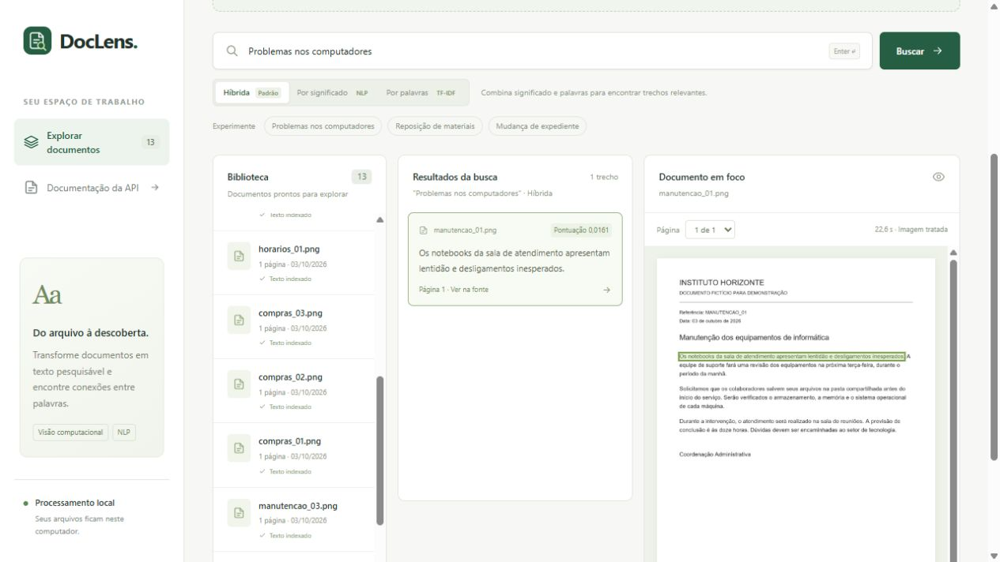

# Validação da opção híbrida

Validação executada em 03/10/2026, no Windows, com Python 3.12, CPU e modelos locais já baixados.

- `pytest -m "not models" -q`: **51 testes passaram**.
- `DOCLENS_RUN_MODELS=1 pytest -m models -q`: **1 teste passou**, com OCR real de PNG/PDF,
  busca híbrida padrão, NLP explícito e TF-IDF sem sobreposição lexical.
- `ruff check doclens scripts tests`: passou.
- `ruff format --check doclens scripts tests`: passou, 27 arquivos.
- `node --check static/app.js`: passou.
- API em execução: OpenAPI publica `hybrid`, `semantic` e `tfidf`, com padrão `hybrid`.
  `POST /search` sem `method` usou a opção híbrida e encontrou uma frase sobre notebooks,
  com uma caixa. Os 13 documentos existentes continuaram disponíveis após reiniciar.
- Interface: os três controles permanecem disponíveis, e Híbrida aparece selecionada no
  carregamento. Alternar para NLP mostrou a resposta por significado; TF-IDF retornou vazio
  para a paráfrase de computadores e encontrou “Reposição de materiais”.
- Híbrida: “Solicitação de capacitação e comprovante de conclusão” priorizou a passagem que
  contém o comprovante, acima do título. “Cardápio do refeitório” retornou vazio e limpou as
  duas caixas do resultado anterior.
- “Problemas nos computadores” retornou uma passagem e uma caixa; imagem e SVG apresentaram
  diferença de largura/altura igual a zero, `viewBox="0 0 1240 1754"` e imagem carregada.
  Não houve rolagem horizontal no viewport padrão. Console sem erros.

A avaliação das 30 consultas sobre reference/clean/degraded está em
[hybrid-search.md](hybrid-search.md), com resultados completos no JSON correspondente.
Os tempos do avaliador incluem cache e não são latência de produção. Não houve avaliação
independente com documentos reais nem teste de breakpoint móvel nesta execução.

