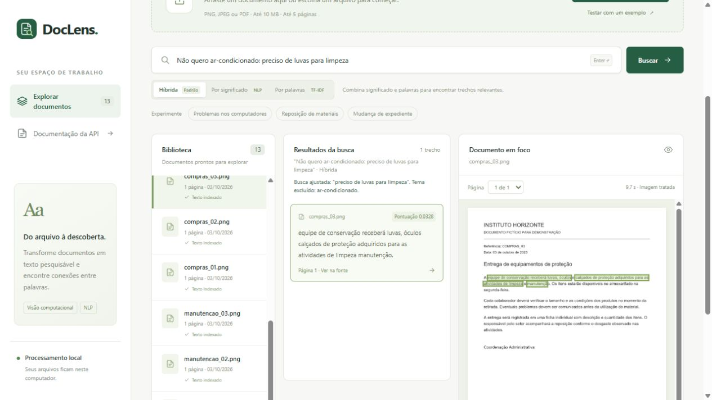

# Revisão dos cinco casos de busca

Dois casos de recuperação e um falso positivo foram corrigidos. Os outros dois exigem
informação que não consta explicitamente no corpus original. As decisões estão em
[docs/query-recovery.md](../docs/query-recovery.md).

| Consulta | Antes, híbrida | Depois, híbrida |
| --- | --- | --- |
| probelmas nos computdores | Nenhum trecho | Frase sobre notebooks lentos e desligamentos |
| Não quero ar-condicionado: preciso de luvas para limpeza | Nenhum trecho | Frase sobre luvas e proteção na limpeza |
| Inscrição no plano de saúde dos funcionários | Frase indevida sobre disponibilidade de materiais | Nenhum trecho, rejeição correta |
| O computador não liga | Nenhum trecho | Nenhum trecho: a fonte descreve outros sintomas |
| Onde entregar o certificado depois do curso? | Nenhum trecho | Nenhum trecho: a fonte não informa onde entregar |

A classificação anterior de todas as quatro ausências como falhas de recuperação foi
ampla demais. Ter um documento do mesmo tema não garante resposta à pergunta específica.
As anotações foram preservadas para mostrar a comparação, e os dois casos continuam
contabilizados como ausências na métrica original. Não adicionamos informações aos textos
para alcançar 15/15. Um teste separado com modelos reais confirmou que os três métodos
encontram essas perguntas quando documentos fictícios contêm a informação explicitamente.

## Comparação medida, mesmo OCR limpo

| Método | Foco em top 1, 15 consultas adicionais: antes → depois | Rejeição das 10 perguntas sem resposta originais: antes → depois |
| --- | ---: | ---: |
| Híbrida | 11/15 → 13/15 | 9/10 → 10/10 |
| NLP | 9/15 → 11/15 | 9/10 → 10/10 |
| TF-IDF | 9/15 → 10/15 | 10/10 → 10/10 |

A híbrida manteve foco em top 1 em **20/20** consultas originais com OCR limpo e **19/20**
com OCR degradado. NLP manteve 19/20 e 18/20; TF-IDF manteve 15/20 e 14/20. Os três modos
rejeitaram as sete perguntas adicionais sem resposta e passaram os quatro casos de referências.

TF-IDF continua limitado à sobreposição lexical: corrigir “computdores” para “computadores”
não cria a palavra “computadores” em uma frase que usa “notebooks”. O caso de digitação foi
recuperado pela híbrida e pelo NLP. Os três modos recuperaram a preferência sobre luvas.
Esse resultado preserva a utilidade de comparar métodos diferentes.

Os documentos, passagens, caixas e anotações são os mesmos usados antes. Os tempos incluem
cache do verificador; não representam latência da interface. O corpus sintético já foi
inspecionado e esses casos motivaram as correções: os números são diagnóstico/regressão,
não uma estimativa independente de precisão em documentos novos.

## Verificação

- 136 testes Python rápidos passaram.
- Dois testes com modelos reais passaram, incluindo OCR/PDF e fontes que contêm as respostas específicas.
- Nove testes JavaScript passaram, incluindo aviso literal de consulta ajustada.
- Ruff passou; dependência `pyspellchecker==0.9.0` fixada em `uv.lock`.
- Interface local verificada: digitação e preferência mostram o ajuste, com fonte fictícia correta.
- Consulta do falso positivo retorna zero resultados e limpa os destaques anteriores.
- Os 13 documentos e 13 imagens da biblioteca local foram preservados após reiniciar o servidor.

As estruturas de preferência são limitadas e a correção pode deixar palavras ambíguas
intactas. A regra de evidência sem palavras em comum também é uma heurística. Novos
documentos e consultas ainda podem apresentar erros; pontuação não é probabilidade de acerto.

Detalhes dos cinco casos antes/depois: [query-recovery.json](query-recovery.json).
Todas as consultas atuais: [search-stress.json](search-stress.json) e
[hybrid-search.json](hybrid-search.json).

Reproduzir as métricas atuais:

```powershell
uv sync --locked
uv run python -m scripts.evaluate_stress
uv run python -m scripts.evaluate_hybrid
uv run pytest -m "not models" -q
node --test tests/frontend.test.cjs
$env:DOCLENS_RUN_MODELS = "1"
uv run pytest -m models -q
```

As avaliações requerem os modelos previamente baixados e o cache de OCR de `scripts.evaluate`.
As métricas anteriores são snapshots preservados no JSON de comparação.


